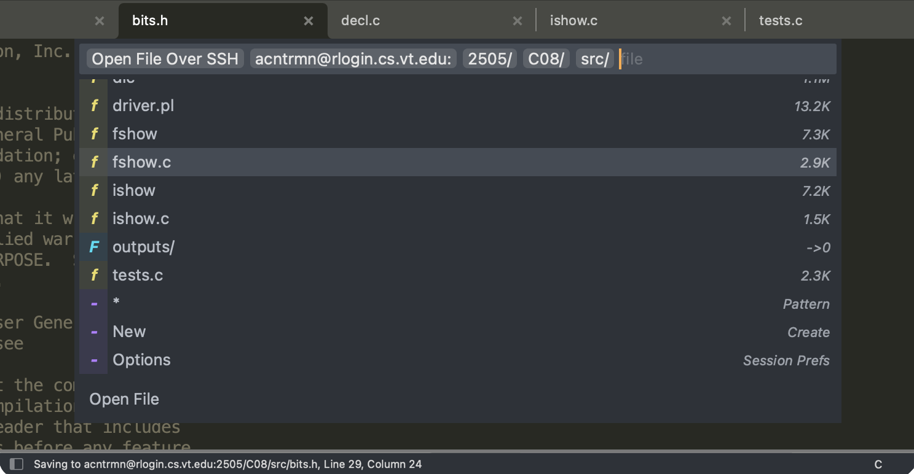

# SublimeOpenFileOverSSH v1.6.0
A lightweight Sublime Text 4 plugin that allows a file to be opened on a remote machine over ssh and seamlessly edited and saved back to the remote machine

<!--
 - This is a large image for retina displays (2x) to help reduce blur on the small text
 - Github doesn't support the srcset  attribute, so this manually sets the width to 743 (half of the image's 1487)
-->

## Installation
This plugin works on MacOS, Linux, and Windows.

### Package Control
Sublime's [Package Control](https://packagecontrol.io/installation) is the best and easiest way to install this plugin.

1. Run the _Package Control: Install Package_ command from the command pallet
2. Search for and select [`OpenFileOverSSH`](https://packagecontrol.io/packages/OpenFileOverSSH)
3. Package Control will automatically install and keep this package up to date

### Manual

1. Clone or download this repo (or a [versioned release](https://github.com/AncientRoman/SublimeOpenFileOverSSH/releases)) into the Sublime Packages folder.
2. Rename the new folder to "OpenFileOverSSH"
3. Restart Sublime Text

## Usage
Trigger the remote file selection using one of these options.

* Use the _File > Open via SSH_ menu item
* Run the _Open File Over SSH_ command from the command palette
* Press _cmd-shift-o_ or _ctrl-shift-o_ (you must set this up, see [Key Bindings](#key-bindings))

Once triggered, input the server details and browse/open remote files as follows.

1. Type in the scp-like path to your server (`user@server.ext:`), and press enter
2. Once the server is validated and connected, a list input will appear which allows you to choose a folder or file
3. Continue browsing the file system on your server until you find the file you want to open
4. Enjoy finally being able to edit a remote file in sublime (CS2505 students amirite)
5. Press shift or command while selecting a file to open the file in the background without closing the file browser

The file browser also contains various actions related to opening files.

* Select the star (\*) to enter and open a pattern like `*.c *.h`
* Select _New_ to create new folders and open new files
* Select _Options_ to edit the current file browser session's settings (See [Settings](#settings) for persistent changes)
* See the [Actions Setting](#actions) to enable additional actions

#### Advanced
The server input can accept other arguments such as paths similar to scp.

* Use a folder path (`user@server.ext:/path/to/folder/`) to open the file browser at a specific folder
* Use a file path (`user@server:path/to/file.txt`) to directly open a file without triggering the picker
* The username can be omitted to use the default user (`server.ext:`)
* A port can be specified using colon syntax (`user@server:port:`)

The file browser shows the size of files in powers of 2 (MiB) and the number of subdirectories in a directory.

This plugin adds the window command `open_file_over_ssh` which accepts `server` string and `paths` array arguments with an optional `port`. You can use this to write your own keybindings, commands, or shortcuts. 
Use like: `window.run_command("open_file_over_ssh", {"server": "user@server", "paths": ["path/to/file1", "/path/to/file2.txt"]})`.

## Important
You will need to setup ssh public/private key login to your remote machine so this plugin can connect to your server in the background without needing a password.

## How it Works
When a remote file is opened, the contents of the file is copied into the buffer. 
When the file is saved, the buffer is copied back into the remote file and sublime is given a temporary file to save to which is later deleted. 
The file transferring is done using Popen's stdin and stdout to ssh, not scp.

The file selection is done by opening an ssh connection after the server is input and `ls` is used to populate the folder/file list on demand.

The only requirements of this plugin are the command `ssh` (which preferably supports OpenSSH config options) on the local machine and and a POSIX compliant shell on the remote machine. In particular, the remote machine should support the POSIX `ls`, `printf`, `cat`, redirection (`>`), `test` (for [Path Checking](#path-checking)), globing (`*`) (to use \* to open files matching a pattern), and `mkdir` (to use _New_ to create folders). However, if a file is opened without triggering the picker (see [Advanced Usage](#advanced)) only `cat` and `>` are needed. 
Some of the file browser's features require the XSI extensions to `ls`. The browser attempts to detect non XSI implementations and will reduce its feature set if possible.

## Settings
Open the settings file with one of these options.

* Use the menu item _Preferences > Package Settings > Open File Over SSH > Settings_
* Run the command pallet command _Preferences: Open File Over SSH Settings_
* Open the file _Packages > User > OpenFileOverSSH.sublime-settings_

#### Hidden Files
Use the `showHiddenFiles` setting to show/hide hidden files in the file browser. 
By default, hidden files are not shown.

#### Actions
The `actions` settings controls the order and visibility of the available file browser actions. 
It accepts an array of action names consisting of `["glob", "new", "lastDir", "pwd", "sysI"]`. 
The default is `["glob", "new"]`.

#### Multiplexing
Ssh's multiplexing feature is used to speed up connection and authentication when browsing and saving files in short succession. 
The default connection keep alive time is 5 minutes and you can change this with the `multiplexing` setting. 
The `multiplexing` key accepts keep alive (ControlPersist) times in the `120s` or `5m` formats. 
If your system doesn't support multiplexing or you'd like to disable it for security reasons, set `multiplexing` to `false`. 
The default windows ssh (OpenSSH_for_Windows) does not support multiplexing, so windows has this setting set to `false`.

#### Timeout
Use the `timeout` setting to control ssh's connection timeout in seconds. 
The default is 7 seconds. 
You can set `timeout` to `null` to use ssh's default timeout which is the system's tcp timeout.

#### Host Key Checking
Host key checking can be controlled with the `hostKeyChecking` key. 
This settings accepts yes, no, accept-new, or null most of which correspond to ssh's StrictHostKeyChecking setting. 
`null` is the default and uses ssh's BatchMode default which is `yes`. 
`yes` throws an error if a key does not exist or match. 
`no` does not check or save keys. 
`accept-new` saves new keys and only errors if a previously saved key has changed.

#### Path Checking
By default, remote files and folders are checked with the `test` command before they are opened. 
You can set `pathChecking` to `false` to disable this extra check. 
If path checking is disabled, any errors will occur after a path is selected instead of before.

### Key Bindings
Key Bindings are disabled by default per Package Control requirements. 
Enable the Open via SSH key binding by opening the key binding file in a similar manner as the settings file and copying over the disabled binding.

## What's New?
v1.6: Added port selection, extra settings-controlled actions, background file opening, and hot exit support 
v1.5: Added file size, hidden files, root dir (/), and remote error checking 
v1.4.1: Fixed silently failing to connect on Windows and added additional error handling 
v1.4: Added multiplexing, menu items, ssh error checking, new file/folder creation, ui updates, settings, and Package Control installation 
v1.3: Support for Sublime Text 4 
v1.2.2: Fixed files in subfolders being opened when a glob was used 
v1.2.1: Fixed crashing sublime when a remote file was opened that did not have a new line at the end 
v1.2: The wildcard (\*) option opens a text input that accepts one or more glob patterns such as \*.c h\* and opening multiple files is wayyyy faster 
v1.1: Added a file browser like interface to the Open File File Over SSH command in the command pallet 
v1.0: First version with Windows support

## Contributing
You can submit a PR if you'd like, but if you find a bug or would like a new feature feel free to open an Issue. 
I'll respond to either as soon as I can.
